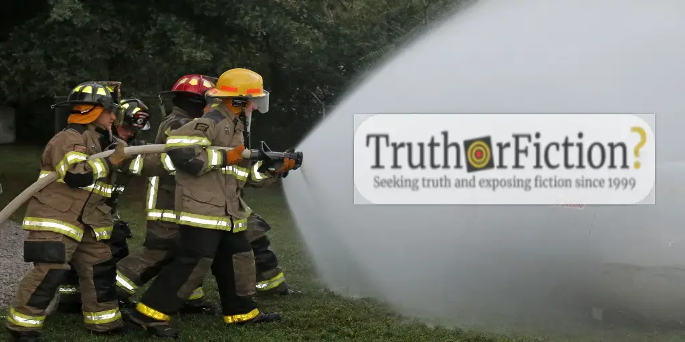

# How to Fight Disinformation — Part I: Firehosing

by Brooke Binkowski | published: 2020-12-04

***This is part of [an ongoing series](https://web.archive.org/web/20230211191932/https://www.truthorfiction.com/how-to-fight-disinformation-introduction-and-overview/) about how communities can fight back and protect themselves against weaponized disinformation.***

- Part 0: [Introduction](How to Fight Disinformation — Introduction and Overview.html)
- Part I: [Part I - Firehosing](How to Fight Disinformation — Part I — Firehosing.html)
- Part II: [Part II - Gaslighting](How to Fight Disinformation — Part II — Gaslighting.html)
- Part Ⅲ: [Part III - Distraction](How to Fight Disinformation — Part III — Distraction.html)
- Part IV: [Part IV - Signaling and Dog Whistling](How to Fight Disinformation — Part IV — Signaling and Dog Whistling.html)
- Part V: [Part V - Resilience Targeting](How to Fight Disinformation — Part V — Resilience Targeting.html)

---

Any anthropologist can tell you that human lives are created, bounded, and defined by stories: the stories we tell ourselves about us, each other, the world around us, and what might lie beyond. And any propagandist can tell you that you can change future human behavior by changing those stories. Without mapping out what we have done, we cannot know what is possible.

Journalist and resolutely anti-fascist author George Orwell knew this; his seminal, dystopian work _1984_ contains the following slogan from the authoritarian Party in power. “Who controls the past,” [it says](https://www.google.com/books/edition/1984/uyr8BAAAQBAJ?hl=en&gbpv=1&dq=controls+the+past+controls+the+future+orwell&printsec=frontcover)[^1984], “controls the future: who controls the present controls the past.”

It may be a cliche to include an Orwell quote in an article about disinformation, but sometimes cliches exist for good reason; in this case, it is the entire basis of the sort of psychological attacks that have been leveled against the people of the world since at least 2016.

It is also one of the strongest weapons that social media can be harnessed to use against the public at large by offering a speed and scale previously undreamed of by even the most ardent propagandist. What is one surefire way to erase the recent past from the public consciousness in order to write over it on a newly clean historic slate?

You flood it out, of course. “Firehosing” is a Kremlin-originated technique that the Rand Corporation called in a 2016 report, “the firehose of falsehood,” and which indicted fraudster Steve Bannon, inexplicably regarded as a political genius for far too long, called “flooding the zone with shit.” Both analogies are accurate. The “flood” or the “firehose” is a relentless spray of factual and counterfactual stories, emotional pleas and emotional violence, and abusive rhetoric and invective that so quickly gets carried over into national and global conversations and from there into policy that there is almost no time to fact-check it.

Much of this spray is what the European Union’s anti-disinformation effort calls “[InfoShum](https://euvsdisinfo.eu/infoshum-the-new-trend-in-kremlin-propaganda/)[^infoshum],” that is, “white noise” that has no purpose other than to overwhelm or flood out certain narratives, and what they simply refer to as “[bullshit](https://euvsdisinfo.eu/bullshit-the-noisy-conqueror-of-the-information-space/)[^bullshit],” which exists to push specific other narratives, facts be damned:

> Why would anyone spread bullshit? In the end, the goal is to occupy the information space.
> 
> As we flagged in [February](https://euvsdisinfo.eu/six-years-of-mh17-lies-the-kremlin-is-losing-its-own-game/?highlight=mh17)[^february], the Russian Institute for Strategic Studies, a Kremlin-funded think tank, [published an essay](https://euvsdisinfo.eu/occupy-the-information-space/)[^essay] titled “_Securing Information for Foreign Policy Purposes in the Context of Digital Reality_”. The paper claimed that:
> 
> _“A preventively shaped narrative, answering to the national interests of the state, can significantly diminish the impact of foreign forces’ activities in the information sphere, as they, as a rule, attempt to occupy “voids” \[in the information flow\].”_
> 
> This strategy points to the ambition to take away attention from a certain truth. Therefore one who applies this strategy is a liar, not a bullshitter.
> 
> However, both the tactical liar and the bullshitter share an attitude. Substance is secondary, and the primary goal is to flood the information system.
> 
> With this perspective, even false information that does not seem to be directly harmful, is dangerous because it occupies space, hurting the general conditions to establish truth.

This is not a technique that traditional fact-checking can easily combat on its own, which the Rand Corporation pointed out in a 2016 [report](https://www.rand.org/pubs/perspectives/PE198.html)[^report], and which has been proven again and again to be true in the years since:

> We are not optimistic about the effectiveness of traditional counterpropaganda efforts. Certainly, some effort must be made to point out falsehoods and inconsistencies, but the same psychological evidence that shows how falsehood and inconsistency gain traction also tells us that retractions and refutations are seldom effective. Especially after a significant amount of time has passed, people will have trouble recalling which information they have received is the disinformation and which is the truth. Put simply, our first suggestion is **_don’t expect to counter the firehose of falsehood with the squirt gun of truth_.**

Repetition leads to familiarity and in turn, acceptance or resignation. This spray of false, misleading, or decontextualized information has another insidious and very deliberate secondary effect over time: Journalists and fact-checkers (those wielders of squirt guns) become burned out, and so too becomes the public at large; people become dispirited, disheartened, and unable to see beyond the immediate present to a brighter future, much less fight for it.

As mentioned, this is intentional. Nihilism or hopelessness are the intended side effects of models such as these, and the model is difficult to counter by design. But it can still be countered with adjustments, such as anticipating which narratives will be attacked or spread and on whose behalf, and explaining who might benefit:

> _Forewarning_ is perhaps more effective than retractions or refutation of propaganda that has already been received. The research suggests two possible avenues:
> 
> Propagandists gain advantage by offering the first impression, which is hard to overcome. If, however, potential audiences have already been primed with correct information, the disinformation finds itself in the same role as a retraction or refutation: disadvantaged relative to what is already known.[35](https://www.rand.org/pubs/perspectives/PE198.html#fn35)
> 
> When people resist persuasion or influence, that act reinforces their preexisting beliefs.[36](https://www.rand.org/pubs/perspectives/PE198.html#fn36) It may be more productive to highlight the ways in which Russian propagandists attempt to manipulate audiences, rather than fighting the specific manipulations.

In an information space that is defined by this sort of high volume and high stress, it is extremely easy for even the most battle-scarred adversaries of disinformation to occasionally fall for a hoax or an emotionally charged, convincing mistruth.

“We think we’re so smart — and then you get online and you’re inattentive and suddenly, you’re being manipulated,” Christopher Paul — co-author of the aforementioned paper, “The Russian ‘Firehose of Falsehood’ Propaganda Model: Why It Might Work and Options to Counter It,” told us. Researchers have for years pointed out the existence of bias blind spots, which — as the name implies — describes how even the most savvy reader (yes, including you) can be occasionally snookered.

In fact, there is some evidence that higher intelligence might mean a larger propensity toward a bias blind spot, as a study by [researchers](https://www.cmu.edu/news/stories/archives/2015/june/bias-blind-spot.html)[^researchers] from Carnegie Mellon University, the City University London, Boston University, and the University of Colorado, Boulder and published in the journal _Management Science_ (“Bias Blind Spot: Structure, Measurement, and Consequences”) [pointed out](https://pubsonline.informs.org/doi/abs/10.1287/mnsc.2014.2096)[^pointed-out][^pointed-out-pdf] in 2015:

> Participants who reported significantly higher openness to experience had higher bias blind spot scores, although the moderate size of the coefficient suggests that the two constructs are sufficiently discriminated. This result was not predicted. Because open-minded thinking has been shown to correlate with superior cognitive ability in a number of domains (Stanovich and West 2007, West et al. 2008), it is possible that if people high in openness to experience have both superior cognitive ability and some awareness of that ability, they might accurately report that they are less susceptible to bias than their peers.

This is in line with Paul’s experiences, as well. “When I brief ‘Firehose of Falsehood’ to an audience I get to a certain point, and I can see people in the audience looking to the left and the right and going, _oh you poor humans,_ and leaving themselves out of it! They’re like, Oh, _you’ve_ got all these problems,” he said.

But education and awareness can significantly mitigate this tendency — which are crucial weapons for fighting disinformation attacks across the board:

> It has been proposed that decision making may be a teachable skill (Baron and Brown 1991, Bruine de Bruin et al. 2007, Fischhoff 1982, Larrick 2004), and correlational evidence has suggested that people who have received formal training in decision making may obtain better life outcomes (Larrick et al. 1993). If so, then the bias blind spot represents an obstacle to improving the quality of both work and life because it bolsters resistance to debiasing training aimed at improving decision-making ability. This influence is not irrevocable. We have found that propensity to exhibit bias blind spot can be reduced by as much as 39% in a related research program consisting of scenarios in which participants could exhibit bias blind spot and were then provided with critical feedback and training (Symborski et al. 2014).

Understanding the issues that disinformation and propaganda are able to seize onto and countering the specific outcomes they intend to bring about and educating others in simple, no-nonsense ways in advance and pointing out easily observable patterns (such as who is spreading what and what they have claimed in the past) rather than simply following along behind fact-checking every lie, can provide a “raincoat” or an “umbrella” to those at whom the spray or flood of lies is directed.

And make no mistake about it. This is not just a bunch of individual grifters shilling lies, although there are certainly those as well; this is organized [hybrid warfare](http://connections-qj.org/article/hybrid-war-high-tech-information-and-cyber-conflicts)[^hybrid-war][^hybrid-war-pdf] intended to bring about specific political outcomes:

> Media analysis has demonstrated the significant consequences of mass usage of widespread, negative social political information campaigns. First, cyber aggression against key figures in government is expected to encourage the widening range of negative information streams in order to aggravate existing civil mistrust and anti-government behavior. When this is extended into social media, the spread of false and malicious information encourages beliefs and behavior that would normally be kept in check by existing social mores and civic expectations. Even if information does not create a conscious change in beliefs, it can impact the interpretation of future information by providing effective anchoring and priming media.[^footnote30] This can aid a domestic aggressor wishing to influence the course of the conflict in order to weaken support for the target government. In some cases, such information warfare can replace kinetic operations, undermining defensive campaigns before they even need to begin.
> 
> Cyber aggression often conceals its actors and motives, shrouded by technological methods that can mask their manipulative goals. The methods of concealment include anonymous claims to authority, news items manipulated with half-truths, repetition of messages, information overload, cyber-pseudo operations (government posing as insurgents), sock-puppeting (government agents playing the role of online commentators), and astro-turfing (creating of false grassroots movements).[^footnote31]

There are already strategies that are known to be highly effective against hybrid warfare techniques, but they require swift and responsive intervention:

> The effective prevention and detection of enemy’s information and psychological actions in cyber space and our quick reaction require the creation of national centers of countermeasures to information and cyberattacks. The national centers should unite and facilitate coordination among international centers providing countermeasures to cyber threats. The national centers should provide monitoring and detection of destructive effects and identify signs, mechanisms (strategies, tactics, techniques, forms and methods) of their implementation. They should detect the sources and variants of spreading dangerous contents, interconnection during the operation (actions) among various Internet resources for defining the aim of the actions and possible results.
> 
> Measures for neutralization of destructive information and cyber effects and their sources are:
> 
> \-Warning the owners (if they are known) of Internet resources about restrictions against spreading fake, untruthful information with the recommendation of its deletion if the information harms subjects and objects of national security (person, society, state)
> 
> \-Creating public registries for unreliable/suspected resources.

In a perfect world, or even a slightly better one, institutions such as journalism would thus be empowered to stop the cycle before it began by short-circuiting the disinformation loop before it became part of the national (or international) conversation and then enshrined into national (or international) policy. The way to empower newsrooms is by restoring the funding that has been stripped from them by social media platforms, which can choke off access to information at will.

Governments would also understand and recognize the security threats carried by disinformation campaigns (one only needs to look at the disastrous effects that weaponized propaganda has had around the spread of [COVID-19](https://euvsdisinfo.eu/eeas-special-report-update-short-assessment-of-narratives-and-disinformation-around-the-covid-19-pandemic-update-may-november/)[^covid19] in the [United States](https://esoc.princeton.edu/publications/esoc-covid-19-disinformation-tracking-report)[^misinformation-dataset] and beyond, for one particularly glaring example) and move to counter them with appropriate information. Ideally, too, social media companies would recognize this very human tendency and move to counter it for the sake of national and global security, instead of allowing bad actors to exploit such blind spots for personal gain and profit.

But this is not yet an ideal world, nor even a slightly better one. However, that is where anyone public can fight back online with the right tools and bring about significant results — even against intense firehosing.

It starts with forming networks and communities to carry out actions against these attacks. “The moment you start to organize, there’s all kinds of things a collective could do to protect each other,” Paul said.

For example, forming “brigades” of trusted contacts to split the efforts of fact-checking is helpful; using those same organized “brigades” to mass report lies and propaganda as they makes their usual way from the fringes to the mainstream using social media networks as vehicles and publicly pressure platforms so that they have no choice but to act would be more helpful still.

Other options include educating friends within your networks in advance of anticipated disinformation campaigns and preserving a continuity of information, so that no one can rewrite the past. Befriend or follow anti-disinformation journalists and academics on social media, and above all, remember that weaponized disinformation and propaganda is always opportunistic and reflexive, which also means it can be pre-empted and disrupted with timely action. Bring in everyone you can and ruthlessly moderate within the networks that you create.

We cannot control who attacks us and how, but we can choose how we respond to this new, wild world of weaponized disinformation and propaganda. With just a few changes, we can form the habits and customs that we need in order to [build resilience](https://old2.enseccoe.org/data/public/uploads/2017/03/zurnalas_no11_sp_176x250mm_3mm_2.pdf)[^build-resilience][^build-resilience-pdf] agains what is already here, and whatever is still to come.

[^1984]: [https://archive.org/details/GeorgeOrwells1984](https://archive.org/details/GeorgeOrwells1984)
[^bullshit]: [https://archive.is/N3L0V](https://archive.is/N3L0V)
[^infoshum]: [https://archive.is/h7rB0](https://archive.is/h7rB0)
[^february]: [https://archive.is/M4vIR](https://archive.is/M4vIR)
[^essay]: [https://archive.is/KRmUJ](https://archive.is/KRmUJ)
[^report]: [https://archive.is/NmMVj](https://archive.is/NmMVj)
[^researchers]: [https://archive.is/aaG7f](https://archive.is/aaG7f)
[^pointed-out]: [https://archive.is/4cAsr](https://archive.is/4cAsr)
[^pointed-out-pdf]: [https://archive.is/X46bU](https://archive.is/X46bU)
[^hybrid-war]: [https://archive.is/wccur](https://archive.is/wccur)
[^hybrid-war-pdf]: [https://archive.is/2uWmQ](https://archive.is/2uWmQ)
[^footnote30]: [https://connections-qj.org/article/hybrid-war-high-tech-information-and-cyber-conflicts#%5Fftn30](https://connections-qj.org/article/hybrid-war-high-tech-information-and-cyber-conflicts#%5Fftn30)
[^footnote31]: [https://connections-qj.org/article/hybrid-war-high-tech-information-and-cyber-conflicts#%5Fftn31](https://connections-qj.org/article/hybrid-war-high-tech-information-and-cyber-conflicts#%5Fftn31)
[^covid19]: [https://archive.is/EswcU](https://archive.is/EswcU)
[^misinformation-dataset]: [https://archive.is/7nKSR](https://archive.is/7nKSR)
[^build-resilience]: The original link is dead. They have it archved on their site.
[^build-resilience-pdf]: [https://archive.is/snsUm](https://archive.is/snsUm)
