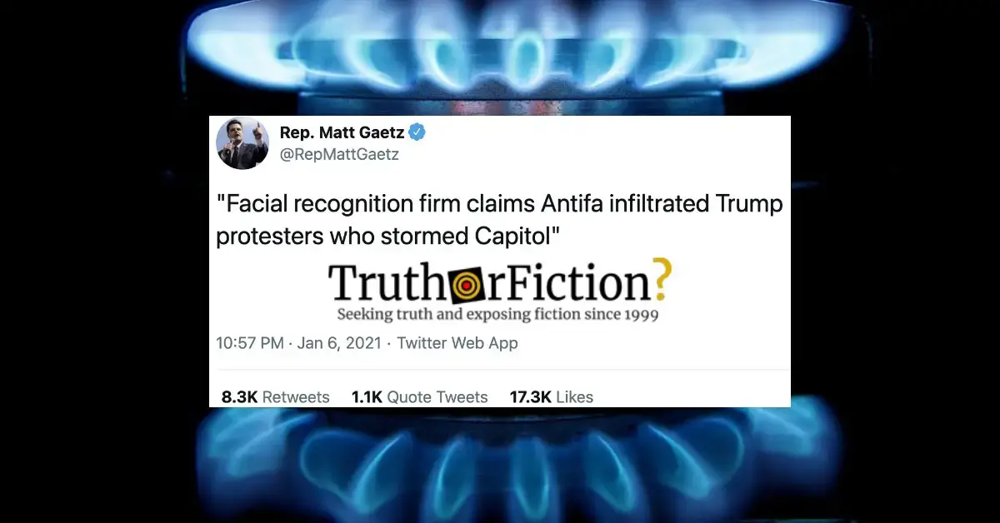

# How to Fight Disinformation: Part II — Gaslighting

by Brooke Binkowski

***This is part of [an ongoing series](https://web.archive.org/web/20230211191932/https://www.truthorfiction.com/how-to-fight-disinformation-introduction-and-overview/) about how communities can fight back and protect themselves against weaponized disinformation.***

- Part 0: [Introduction](How to Fight Disinformation — Introduction and Overview.html)
- Part I: [Part I - Firehosing](How to Fight Disinformation — Part I — Firehosing.html)
- Part II: [Part II - Gaslighting](How to Fight Disinformation — Part II — Gaslighting.html)
- Part Ⅲ: [Part III - Distraction](How to Fight Disinformation — Part III — Distraction.html)
- Part IV: [Part IV - Signaling and Dog Whistling](How to Fight Disinformation — Part IV — Signaling and Dog Whistling.html)
- Part V: [Part V - Resilience Targeting](How to Fight Disinformation — Part V — Resilience Targeting.html)

---

On January 6 2021, a mob of Donald Trump supporters, enraged by corrosive rhetoric and lies from public figures spread on social media, stormed the Capitol building in Washington, D.C., leaving a trail of death and destruction in their wake.

Almost immediately after that, the gaslighting began.

“They were masquerading as Trump supporters, and in fact were members of the violent terrorist group Antifa,” claimed [Matt Gaetz](https://www.tampabay.com/news/florida-politics/2021/01/07/how-matt-gaetz-spread-a-falsehood-about-antifa-infiltrating-the-mob-that-attacked-congress/)[^gaetz], citing a Washington Times story claiming that facial recognition had discovered the nonexistent subterfuge. The fact that the story was almost immediately [thoroughly debunked](https://www.thedailybeast.com/group-behind-gaetzs-antifa-mob-claim-say-its-a-lie)[^debunked] and quietly [removed](https://www.truthorfiction.com/antifa-infiltrated-trump-supporters-claim-during-capitol-riots-by-washington-times-apparently-deleted/)[^removed] from the site did nothing to curtail it from persisting, like a bad smell, as hearsay and rumor. “Do not be surprised if we learn in the days ahead that the Trump rioters were infiltrated by leftist extremists. Note: this is not to excuse any of them,” added right-wing commentator [Brit Hume](https://twitter.com/brithume/status/1346998652498309121)[^hume], enthusiastically pouring gasoline on the rhetorical fire.

Their interpretation of the events were so far removed from verifiable fact as to be [brazen attacks](https://apnews.com/article/us-capitol-siege-trump-supporters-8edfd3bb994568b7cdcd2243ad769101)[^brazen] on reality from established purveyors of weaponized disinformation:

> Lin Wood, an attorney who has filed lawsuits seeking to overturn the presidential election, [said](https://web.archive.org/web/20210106214604/https://parler.com/post/d7c28cc4a7714e1c8f704eb769b54c59) on Parler that he had “indisputable photographic evidence” of antifa involvement. Twitter [suspended his account](https://www.forbes.com/sites/jackbrewster/2021/01/07/lin-wood-lawyer-closely-tied-to-trump-permanently-banned-from-twitter-after-claiming-capitol-siege-was-staged/?sh=318e09261be3)[^suspended] for claiming the Capitol breach was “staged.”
> 
> Former Republican vice presidential candidate Sarah Palin [warned](https://archive.is/SFsH5) of “fake DC ‘patriots’ used as PLANTS.” Other Republican politicians promoted similar rumors about antifa, including Texas Attorney General [Ken Paxton](https://archive.is/c6Sfo), Rep. [Paul Gosar](https://archive.is/KAOpL) of Arizona, and Rep. [Mo Brooks](https://archive.is/mW94E) of Alabama.
> 
> “This has all the hallmarks of Antifa provocation,” Gosar tweeted at 2:04 p.m.
> 
> “Rumor: ANTIFA fascists in backwards MAGA hats,” Brooks added 16 minutes later.

Some were outraged; others bemused (why would anti-fascists, who have routinely protested Donald Trump’s policies and activities as president, work to keep him in office); still others accepted the lie from authority figures wholesale, leaving increasingly exhausted journalists to try to sift through the mess to find the bedrock of reality beneath.

And that, of course, is the mechanism and goal of gaslighting. If you can’t use it to persuade people or pull the wool over their eyes, you can at least use a volatile mix of blatant lies and emotional manipulation in order to perplex and confuse them into ideological paralysis as they argue over their own interpretations of what really happened — or at the very least, distract them from paying attention to one topic or action by claiming or doing something outrageous. And so it ever was, as [political theorist Hannah Arendt](https://hac.bard.edu/about/hannaharendt/)[^hannah-arendt] points out in her classic essay, “Truth and Politics”:

> The story of the conflict between truth and politics is an old and complicated one, and nothing would be gained by simplification or moral denunciation. Throughout history, the truth-seekers and truthtellers have been aware of the risks of their business; as long as they did not interfere with the course of the world, they were covered with ridicule, but he who forced his fellow citizens to take him seriously by trying to set them free from falsehood and illusion was in danger of his life: “If they could lay hands on \[such a\] man . . . they would kill him,” Plato says in the last sentence of the cave allegory.
> 
> The Platonic conflict between truthteller and citizens cannot be explained by the Latin adage, or any of the later theories that, implicitly or explicitly, justify lying, among other transgressions, if the survival of the city is at stake. No enemy is mentioned in Plato’s story; the many live peacefully in their cave among themselves, mere spectators of images, involved in no action and hence threatened by nobody. The members of this community have no reason whatever to regard truth and truthtellers as their worst enemies, and Plato offers no explanation of their perverse love of deception and falsehood.

“Gaslight,” when used as a verb rather than a noun, is a relatively new word — it comes from the 1938 play _Gas Light_ (which was subsequently turned into a 1944 film called _Gaslight_, shortened to just one word) about a man who lies to his wife to cover up his crimes and is able to convince herself and everyone around her that she is insane — but that does not mean the concept is new. Lies so outrageous that they challenge the very bedrock of the reality that we all share have been used by the corrupt for personal or political gain since well before such a term existed. The eventual goal, as Arendt points out later in her essay, is to create an exhausted population which can be convinced to feel that truth and facts are malleable, making their collective behavior easier to control (a diabolically effective technique when paired with [[Github/How to Fight Disinfomation/How to Fight Disinformation — Part I — Firehosing|firehosing]].

> What seems even more disturbing is that to the extent to which unwelcome factual truths are tolerated in free countries they are often, consciously or unconsciously, transformed into opinions – as though the fact of Germany’s support of Hitler or of France’s collapse before the German armies in 1940 or of Vatican policies during the Second World War were not a matter of historical record but a matter of opinion. Since such factual truths concern issues of immediate political relevance, there is more at stake here than the perhaps inevitable tension between two ways of life within the framework of a common and commonly recognized reality. What is at stake here is this common and factual reality itself, and this is indeed a political problem of the first order. And since factual truth, though it is so much less open to argument than philosophical truth, and so obviously within the grasp of everybody, seems often to suffer a similar fate when it is exposed in the market place – namely, to be countered not by lies and deliberate falsehoods but by opinion – it may be worth while to reopen the old and apparently obsolete question of truth versus opinion.

But just because it was always that way does not mean our response to it cannot and should not change. The technique itself has changed and evolved with the times, so as with so many other forms of emotional abuse turned into political manipulation, it has been given far more speed and scale and therefore power by social media and its weaponized algorithms. “A lie can make it halfway around the world while the truth is putting on its shoes,” as the [perhaps apocryphal saying](https://quoteinvestigator.com/2014/07/13/truth/)[^apocryphal] goes, but thanks to social media, a carefully crafted lie can now circle the world three times, be enshrined into national policy, and spark an international conflict before the truth even rolls over to turn off the alarm.

And the response can similarly evolve. Weaponized gaslighting attacks produce the same sense of unreality, no matter the scale, which come with the same problems. And just as abusive partners work to isolate their victims from friends and family members who might snap them out of the spell of lies they have woven, so too do [gaslighting leaders](https://theconversation.com/gaslighting-from-partners-to-politicians-how-to-avoid-becoming-a-victim-121828)[^gaslighting] attack the press:

> When it comes to politics, the signs are similar. You may feel confused and alone in the world, assuming nobody understands your point of view and that it must therefore be wrong. Take racism. You may have known exactly what it is. But when Trump [accused US Congresswomen of colour](https://www.theguardian.com/us-news/2019/jul/15/donald-trump-congresswomen-republicans-ocasio-cortez-tlaib-pressley-omar)[^accused] of “racist hatred” in response to himself being criticised for racist remarks against them, this could have sown confusion about what racism actually means.
> 
> It is similarly hard to complain to a gaslighting leader. Several journalists who have questioned Trump [have simply been banned](https://www.cnbc.com/2018/11/08/white-house-bans-cnn-reporter-jim-acosta-after-a-confrontation-with-trump-.html)[^banned] from his conferences and [told they do fake news](https://www.cnbc.com/2018/11/13/cnn-sues-president-trump-and-white-house-for-banning-reporter-jim-acosta.html)[^fake-news].

So, how to fight the scourge of gaslighting, firehosing, and other attacks by public officials on American institutions, individuals, the nature of reality itself?

It turns out that the best defense against such a weapon is getting out ahead of it, says [disinformation expert Stephan Lewandowsky](https://research-information.bris.ac.uk/en/persons/stephan-lewandowsky#:~:text=Stephan%20Lewandowsky%20%E2%80%94%20University%20of%20Bristol)[^disinfo-expert], who points out there is a lot of truth in the adage, “Forewarned is forearmed” (and never more so than during protracted disinformation attacks):

> If people are made aware that they might be misled before the misinformation is presented, there is evidence that people become resilient to the misinformation.
> 
> This process is variously known as ‘inoculation’ or ‘prebunking’ and it comes in a number of different forms. At the most general level, an upfront warning may be sufficient to reduce – but not eliminate – subsequent reliance on misinformation. In one of our studies, led by Ullrich Ecker, we found that telling participants at the outset that ‘the media sometimes does not check facts before publishing information that turns out to be inaccurate’ reduced reliance modestly (but significantly) in comparison to a retraction-only condition. A more specific warning that explained that ‘research has shown that people continue to rely on outdated information even when it has been retracted or corrected’, by contrast, reduced subsequent reliance on misinformation to the same level as was observed with a causal alternative.
> 
> A more involved variant of inoculation not only provides an explicit warning of the impending threat of misinformation, but it additionally refutes an anticipated argument that exposes the imminent fallacy. In the same way that a vaccination stimulates the body into generating antibodies by imitating an infection, which can then fight the real disease when an actual infection occurs, psychological inoculation stimulates the generation of counter-arguments that prevent subsequent misinformation from sticking.

It is remarkable how well debunking a disinformation narrative in advance, or even in its very early stages before it can truly take hold, can short-circuit its purveyors’ and useful idiots’ claims; the flip side of propaganda campaigns on social media is that because they are public by design, they can be countered by anyone with open-source citations. It is helpful for social groups online to form informal networks and groups dedicated to countering harmful disinformation before it really takes hold, and brigading and mass reporting those who try to direct harmful, untruthful narratives.

But what about once it has already hooked itself into the national discussion? It is always more difficult to excavate a falsity that has grown roots into a topic than it is to prevent it from growing them to begin with. But it is not impossible. Fighting “Big Lies” takes patience, a willingness to confront lies and to tell the truth, and access to either primary sources or vetted secondary ones. In other words, it takes journalism. But if you are not a journalist, you can help them by keeping score, as a 2016 article in [*Teen Vogue*](https://www.teenvogue.com/story/donald-trump-is-gaslighting-america)[^teen-vogue] (the headline of which, incidentally, is “Trump Is Gaslighting America”) details:

> There are things you can and should be doing to turn your unrest into action, but first let’s empower ourselves with information. Insist on fact-checking every Trump statement you read, every headline you share or even relay to a friend over coffee. If you find factual inaccuracies in an article, send an email to the editor and explain how things should have been clearer. Inform yourself about which outlets are trustworthy and which aren’t. If you need extra help, seek out a browser extension that flags misleading sites or print out a list of fake outlets, such as the [one by communications professor Melissa Zimdars](https://docs.google.com/document/d/10eA5-mCZLSS4MQY5QGb5ewC3VAL6pLkT53V%5F81ZyitM/preview)[^zimdars], and tape it to your laptop. Do a thorough search before believing the agenda Trump distributes on Twitter. Refuse to accept information simply because it is fed to you, and don’t be afraid to ask questions. That is now the base level of what is required of all Americans. If facts become a point of debate, the very definition of freedom will be called into question.
> 
> It will be far easier to take on Trump’s words when there is no question of what he’s said or whether he means it. Regardless of your beliefs, we all must insist on that level of transparency. Trump is no longer some reality-TV clown who used to fire people on _The Apprentice_. He is the president of the United States.

Credible and vetted news organizations go to the trouble of sifting through the daily chaff of lies and misinterpretation to get at the truth, effectively facilitating a conversation between the public and the policymakers whose decisions affect everyone. Historians collect and interpret such events over time, and sociologists put them into perspective. The rest of the human sciences also play roles in building society-wide resilience against disinformation and propaganda. Because these fields essentially play the role of truth-tellers in the relationship between the people, their perspectives, and their politicians, they are always the first to be attacked and isolated. But they must be seen as what they truly are — bulwarks against disinformation campaigns and Big Lies such as those being inflicted on the United States in January 2021, in the days immediately following a right-wing, deadly insurrection attempt.

But you cannot simply offer up facts and wait for them to vanquish gaslighters. If it was that easy, fact-checkers would have put themselves out of work by now. Instead, the public must learn to _build resilience_ to weaponized rhetoric and political lies. Such a feat involves agreeing on a shared reality and refusing to entertain bad actors with a history of lies. To do otherwise eventually erodes the victim’s confidence [to tell truth from lies](http://www.law.nyu.edu/sites/default/files/upload_documents/eb%20rd%20gaslighting%20citizens%20nyu%20colloquium.pdf)[^truth-from-lies] at all:

> Gaslighting and mobilizing both target the lower-level code of citizens: to change how we handle evidence, whether disquieting or hopeful in character. Gaslit citizens have been manipulated in a morally distinctive way, one that targets a particular epistemic mechanism, our evidence about our evidence. Such manipulation poses a real threat to our agency — perversely making us complicit in this process.
> 
> Yet insisting on exercising our own epistemic capacities, and fortifying against gaslighting, threatens our ability to sustain meaningful political action with others. What’s at stake is the felt need of citizenship — to see our own agency in our home institutions. In ordinary life, we experience our agency most dramatically when we manage to stick to commitments over time, allowing us to complete difficult and risky projects. That need is no less significant in democratic politics, where confidence that we will be jointly efficacious is part of the price of admission.

And what does [building resilience](https://www.macdonaldlaurier.ca/avoid-failure-building-societal-resilience-disinformation-subversion-policy-brief-balkan-devlen/)[^building-resilience] to [disinformation](https://www.demdigest.org/learn-to-discern-building-resilience-against-disinformation-disorientation/)[^disinformation] [attacks](https://dr.ntu.edu.sg/bitstream/10220/46093/1/CO18153.pdf)[^attacks] look like? It will look different for every country, but the [basic requirements](https://blogs.lse.ac.uk/medialse/2020/04/08/why-resilience-to-online-disinformation-varies-between-countries/)[^basic-requirements] do not change. It requires a society-wide approach, which starts with self-reflection about our own vulnerabilities as individuals and nations and empowering [independent journalism](https://www.hybridcoe.fi/wp-content/uploads/2020/07/News-Media-and-Legal-Resilience_2019_HCPaper-ISSN.pdf)[^independent-journalism] and other democratic institutions, and continues with all of us, the population at large, privately and publicly standing up for the truth both online and off. Resilience to disinformation campaigns demands stricter guidelines and rules to keep extremists, propagandists, and other information warmongers out of power. It also requires mutual aid and co-operation — as well as tolerating a certain amount of friction in the national discourse for the sake of arguing out differences. It will take education offensives, journalism foundations, and scrutiny of what renders us vulnerable. It will not be easy to do, but it must be done — because the only alternative to systemic change is losing democracy to authoritarianism altogether.

[^accused]: [https://archive.is/remNE](https://archive.is/remNE)
[^apocryphal]: [https://archive.is/https://quoteinvestigator.com/2014/07/13/truth/](https://archive.is/https://quoteinvestigator.com/2014/07/13/truth/)
[^attacks]: [https://archive.is/ul0rA](https://archive.is/ul0rA)
[^banned]: [https://archive.is/o3KwG](https://archive.is/o3KwG)
[^basic-requirements]: [https://archive.is/4yqLv](https://archive.is/4yqLv)
[^brazen]: [https://archive.is/JFtZH](https://archive.is/JFtZH)
[^building-resilience]: [https://archive.is/FGNLA](https://archive.is/FGNLA)
[^debunked]: [https://archive.is/BuJNz](https://archive.is/BuJNz)
[^disinfo-expert]: [https://archive.is/6DPbG](https://archive.is/6DPbG)
[^disinformation]: [https://archive.is/2V45c](https://archive.is/2V45c)
[^fake-news]: [https://archive.is/djBsK](https://archive.is/djBsK)
[^gaetz]: [https://archive.is/r6MHk](https://archive.is/r6MHk)
[^gaslighting]: [https://archive.is/AhW4u](https://archive.is/AhW4u)
[^hannah-arendt]: [https://archive.is/G5qu9](https://archive.is/G5qu9)
[^hume]: [https://archive.is/TIfOI](https://archive.is/TIfOI)
[^independent-journalism]: [https://archive.is/G8Uba](https://archive.is/G8Uba)
[^removed]: [https://archive.is/aXea9](https://archive.is/aXea9)
[^suspended]: [https://archive.is/9ttZw](https://archive.is/9ttZw)
[^teen-vogue]: [https://archive.is/https://www.teenvogue.com/story/donald-trump-is-gaslighting-america](https://archive.is/https://www.teenvogue.com/story/donald-trump-is-gaslighting-america)
[^truth-from-lies]: The original link is dead. [https://archive.is/NTB3v](https://archive.is/NTB3v) ; [https://onlinelibrary.wiley.com/doi/10.1111/ajps.12678](https://onlinelibrary.wiley.com/doi/10.1111/ajps.12678)
[^zimdars]: [https://archive.is/8WQ1c](https://archive.is/8WQ1c)
