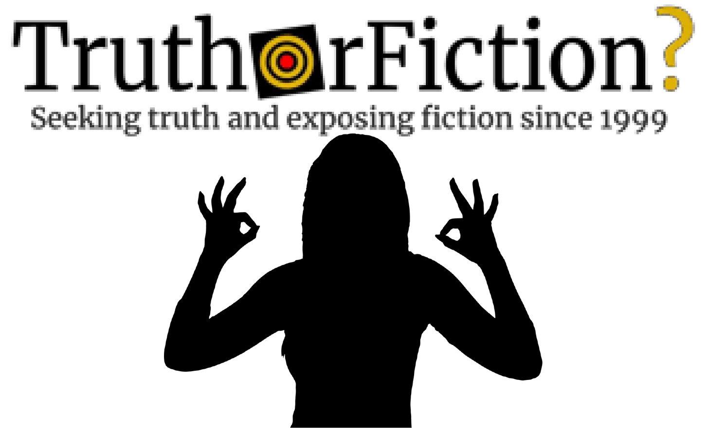

# How to Fight Disinformation — Part IV: Signaling and Dog Whistling

by Brooke Binkowski

***This is part of [an ongoing series](https://web.archive.org/web/20230211191932/https://www.truthorfiction.com/how-to-fight-disinformation-introduction-and-overview/) about how communities can fight back and protect themselves against weaponized disinformation.***

- Part 0: [Introduction](How to Fight Disinformation — Introduction and Overview.html)
- Part I: [Part I - Firehosing](How to Fight Disinformation — Part I — Firehosing.html)
- Part II: [Part II - Gaslighting](How to Fight Disinformation — Part II — Gaslighting.html)
- Part Ⅲ: [Part III - Distraction](How to Fight Disinformation — Part III — Distraction.html)
- Part IV: [Part IV - Signaling and Dog Whistling](How to Fight Disinformation — Part IV — Signaling and Dog Whistling.html)
- Part V: [Part V - Resilience Targeting](How to Fight Disinformation — Part V — Resilience Targeting.html)

---

The Trump administration may be just a memory, but the disinformation that paved its way and the lies that it launched are still very much in effect — and perhaps one of the most pernicious disinformation techniques that it used is the most difficult to describe.

## Fact Check
|  |  |
| ---- | ---- |
| Claim | Donald Trump used coded messages to communicate with his supporters |
| Description | The Trump administration used coded messages and toxic insider humor that may not be easy to interpret for the uninitiated, but has great influence on insiders. This refers to communications that are heard by many but only recognized by some. This technique was used to communicate messages in plain sight through mass or social media while still holding tightly to plausible deniability. |
| Rating | True |
| Rating Explanation | The information provided in the content is overwhelmingly supportive of the claim that Donald Trump used coded messages to communicate with his supporters. Supporting evidence includes the discussion of specific instances and tactics used, academic analyses, and a range of expert inputs. |

That method utilizes coded messages and toxic insider humor to build a communications network that is not easy to for the uninitiated to interpret, but which can have a great [effect](https://www.brandeis.edu/now/2020/october/election-trump-code-mcintosh.html)[^effect] on insiders:

> In his Sept. 29 \[2020\] debate with Joe Biden, Trump remarked that, “Bad things happen in Philadelphia, bad things,” thinly veiled code for right-wing anxieties that swing states will be tipped by left-wing voter fraud. Trump thus nudged his base with a collusive wink: “You and I know what’s really going on, and I’ve got your back.”
> 
> Then there are Trump’s dog whistles. These are provocations superficially not about race but deeply exciting for his racist supporters.
> 
> On the 2015 campaign trail, for instance, Trump mocked Mitt Romney for politically “choking” in competition with Obama by wrapping his hands around his own neck with his tongue out, saying, “I can’t breathe, I can’t breathe!” This “imitation” of Romney was a thinly veiled, mocking allusion to Eric Garner’s last words during his death by choking at the hands of a police officer the year before.
> 
> Yet Trump often wiggles away from charges of racism, sexism and incitements to bigoted violence because he encodes many of his messages in the garb of plausible deniability.

But disinformation and deniability didn’t start with Donald Trump, although he was in a prime position to generate and exploit it after a lifetime in the media. It didn’t start with the people who helped him get into power, either. It is the culmination of years of effort, with specific tactics that have specific aims. Many of them are easy to spot, if not easy to counter, but some are exceptionally slippery cases.

_**Signaling**_ and **_Dog Whistling_** are similar enough to one another that they can both be described here. Where most disinformation campaigns can circulate despite (and even benefit from) maximum uncritical coverage, such as rumors or incomplete narratives, the dog whistle and signaling techniques can only operate as long as they are both public and their underlying meaning is unknown. In other words, they are perpetuated when they are highly covered but their underlying meanings are not known.

That means this [tactic](https://www.truthorfiction.com/how-to-fight-disinformation-introduction-and-overview/)[^tactic] is is tailor-made for ***[[Github/How to Fight Disinfomation/How to Fight Disinformation — Part II — Gaslighting|Gaslighting]]*** techniques, which then can also be used as part of the general ***[[Github/How to Fight Disinfomation/How to Fight Disinformation — Part I — Firehosing|Firehosing]]*** and ***[[Github/How to Fight Disinfomation/How to Fight Disinformation — Part III — Distraction|Distraction]]*** fray. It is very easy to make an investigator or a journalist question their own idea of reality this way, as can be demonstrated by the ubiquity and heat of the discussion around the repurposed “[OK sign](https://www.npr.org/2019/09/26/764728163/the-ok-hand-gesture-is-now-listed-as-a-symbol-of-hate)”[^ok-sign] as just one example, whose flaunters benefited from it already being established as a very common hand [symbol](https://www.adl.org/education/references/hate-symbols/okay-hand-gesture)[^ok-sign2] with multiple meanings:

> The overwhelming usage of the “okay” hand gesture today is still its traditional purpose as a gesture signifying assent or approval. As a result, someone who uses the symbol cannot be assumed to be using the symbol in either a trolling or, especially, white supremacist context unless other contextual evidence exists to support the contention. Since 2017, many people have been falsely accused of being racist or white supremacist for using the “okay” gesture in its traditional and innocuous sense.

The internet tendency to infuse layers of meaning into a single idea, image, or phrase was called _social steganography_ by researcher [Danah Boyd](https://www.danah.org/papers/2011/Steganography-ICAVersion.pdf)[^danah-pdf] at least as far back as 2011:

> Steganography is an age-old tactic of hiding information in plain sight, driven by the notion of “security through obscurity.” Steganographic messages are sent through channels where no one is even aware that a message is hidden. For example, in the ancient Greek text “The Histories,” Demaratus hid a message in the wood beneath the wax of a wax tablet while Histiaeus tattooed a message on a slave’s head that was rendered invisible when his hair grew. In both cases, the message was easily accessible but required knowing that a message existed in the first place. Such techniques are also part of contemporary children’s play with toys like invisible ink pens. Steganography isn’t powerful because of strong encryption; it’s powerful because people don’t think to look for a hidden message. The meaning behind Carmen’s song lyrics post is, for all intents and purposes, invisible.
> 
> \[…\]
> 
> Plausible deniability is an important part of this strategy.

In 2013, BBC picked up on the communication [method](https://www.bbc.com/future/article/20130701-the-internets-undercover-code)[^method], observing that it seemed at that point to be a growing trend among adults as well as youths, especially in countries whose governments did not support freedom of speech:

> Consider this in a world where you are a criminal if you are homosexual in Uganda, if you insult the monarch in Thailand, and if you say anything that Kim Jong-un’s regime disapproves of in North Korea. What else might cease to be “innocent” under future data-hungry governments?
> 
> That explains why a fine pedigree of social steganography already exists online. In China, which boasts perhaps the world’s most sophisticated system of internet surveillance and censorship, the state’s favourite euphemism for crushing dissent – hé xié, or “harmony” – has become a surreptitious rallying cry for rebellion, courtesy of homophonic word play. Because Mandarin Chinese is a tonal language, a word’s meaning can change with the intonation of a single syllable. Thus a slightly altered pronunciation of “harmony” yields the phrase “river crab”, a fictional creature used as a satirical means of mocking censorship. River crab has lent its name to an online political cartoon, Hexie Farm, which was banned by the Chinese government in 2011 but has nonetheless helped initiate free speech and human-rights campaigns.

But what flew under the radar at that time was how that exact mechanism was being co-opted and exploited by those very same repressive governments, in order to hijack pro-democracy movements while at the same time signaling their intent to others. This is a very easy way to spread messages in plain sight through mass or social media while still holding tightly to plausible deniability — and [skepticism](https://www.splcenter.org/hatewatch/2018/09/18/ok-sign-white-power-symbol-or-just-right-wing-troll)[^skepticism] that such tactics exist only allow them to flourish:

> The problem, of course, is that there _are_ white nationalists, neo-Nazis and Klansmen who have increasingly begun using the use of the symbol both to signal their presence to the like-minded, as well as to identify potentially sympathetic recruits among young trolling artists flashing it. To them, the configuration means WP, for “white power.”
> 
> This use of the signal preceded the 4chan hoax that made it go viral. A number of alt-right figures, notably white-nationalist guru Richard Spencer, published [photographs](https://twitter.com/RichardBSpencer/status/796132542739083264)[^photographs] of themselves using the symbol as early as 2016\. [Milo Yiannopoulos](https://www.splcenter.org/hatewatch/2017/02/23/how-stephen-bannon-made-milo-dangerous)[^milo] adopted the symbol on social media as early as [2015](https://knowyourmeme.com/memes/ok-symbol-%F0%9F%91%8C)[^know-your-meme].
> 
> But by then, the alt-right had already long weaponized the trolling culture and its use of irony to create a hall of mirrors surrounding such “memes.” These can easily be found in other alt-right “ironic” constructs, such as [the hoax religion of “Kek”](https://www.splcenter.org/hatewatch/2017/05/08/what-kek-explaining-alt-right-deity-behind-their-meme-magic)[^kek] (and its home country, Kekistan), or its adoption of [Pepe the Frog](https://www.splcenter.org/hatewatch/2018/03/08/%E2%80%8Bpepe-frog-creator-brings-copyright-lawsuit)[^pepe] as a mascot.

Another, similar tactic to steganography or signaling is arguably more toxic, because is exploited by those seeking or already in positions of influence and power. This version is often utilized by American public figures who are in the process of courting racists and misogynists: They will say something that sounds, at most, like little more than an oddly constructed sentence to the uninitiated, but which holds an entirely different message for those receptive to such messaging. The dual meanings are reflected in the name of this tactic, which is generally called dog whistle politics, or simply dog whistling.

Vox published an [explainer](https://www.vox.com/the-big-idea/2016/11/7/13549154/dog-whistles-campaign-racism)[^explainer] about the tactic back in 2016, including how to identify it, which can be difficult:

> While many people might hear “international banks” quite literally, or maybe as an allusion to Clinton’s ties to foreign financial interests in general, anti-Semites hear something very different. After all, the supposed existence of a cabal of international Jewish bankers working to undermine US democracy is a recurring theme in American anti-Semitism, from Henry Ford’s The International Jew to Reddit troll-conventions. Trump’s choice of language serves as a signal that he is one of them.
> 
> Or at least, that’s what many commentators have alleged. The problem is that it’s hard to establish whether a piece of speech or writing is a dog whistle. Indeed, it’s not obvious what evidence could, in principle, settle a dispute over whether some expression is or isn’t one. They are, by their nature, sneaky things.
> 
> Every now and again, a politician might, in a moment of candor, fess up. (David Kuo, a White House staffer under George W. Bush, reports — referring to speeches by Bush — that “we threw in a few obscure turns of phrase known clearly to any evangelical, yet unlikely to be noticed by anyone else.” Lee Atwater’s infamous remarks on how to imply the n-word without saying it also come to mind: “You say stuff like, uh, forced busing, states’ rights…”)
> 
> But accusations of dog whistling are generally met with exasperated denials.

Again, the greatest strength of signaling and dog whistling in this sense lies in the ability to be heard by many but only recognized by some; it can only exist in a political and mass media disinformation landscape already characterized by firehosing and ferocious gaslighting and distraction, as described in political terms as “multivocal appeals” in a 2014 [paper](https://www.researchgate.net/profile/Bethany-Albertson/publication/271919673%5FDog-Whistle%5FPolitics%5FMultivocal%5FCommunication%5Fand%5FReligious%5FAppeals/links/555e29a708ae9963a114135e/Dog-Whistle-Politics-Multivocal-Communication-and-Religious-Appeals.pdf?origin=publication%5Fdetail)[^paper] by political psychologist [Bethany Albertson](https://experts.utexas.edu/bethany_albertson)[^bethany-albertson]:

> The political effectiveness of these appeals has normative implications. It clearly troubles some political commentators and even a former Bush Administration official. Regarding their use of religious dog whistles, Kuo writes, ‘‘This should have been driving me nuts. It should have offended me far more than anything President Clinton or the Democrats were doing. We were bastardizing God’s word for our own political agenda and feeling good about it’’ (p. 61).
> 
> While a thorough normative evaluation of these appeals is beyond the scope of this article, several factors complicate the issue. First, in a country with this cultural pluralism, some multivocal communication of this sort is inevitable. A diverse population cannot be expected to understand everyone’s references, and speakers cannot always anticipate which references will go over the heads of their audience.
> 
> Also, speaking to a group in language that resonates with them is strategic but it might also be genuine. Michael Gerson, a speechwriter for President George W. Bush, responded to criticism for religious dog whistles by saying: ‘‘They’re not code words; they’re our culture,’’ he said. ‘‘It’s not a code word when I put a reference to T.S. Eliot’s ‘Four Quartets’ in our Whitehall speech \[in London on Nov. 19, 2003\]; it’s a literary reference. Just because some people don’t get it doesn’t mean it’s a plot or a secret’’ (quoted in Cooperman 2004, p 6).

In 2020, Albertson clarified that she did not think the term “[dog whistle politics](https://theconversation.com/trumps-appeals-to-white-anxiety-are-not-dog-whistles-theyre-racism-146070)”[^dog-whistle] applied to Donald Trump’s presidency — in fact, she discouraged media from watering down coverage of his rhetoric by describing it as a mere whistle:

> As language and culture change over time, dog whistles evolve, too.
> 
> In the 1980s and 1990s concepts like “law and order” and “inner city” – phrases well used by Ronald Reagan and [George H.W. Bush](https://www.cnn.com/2018/11/01/politics/willie-horton-ad-1988-explainer-trnd/index.html)[^willie-horton] – might have functioned as political dog whistles. Appealing to white suburbanites’ perception of cities as crime-ridden places overrun with Black and Latino people, they therefore signaled their intent to use the law against people of color to protect white people. Plausibly, 30 years ago, the racial meaning of the phrases might have evaded other listeners.
> 
> Today [news coverage shows](https://www.nytimes.com/2020/06/21/opinion/trump-police-reform.html)[^news-coverage] that Americans [broadly understand the racial connotations](https://theconversation.com/trumps-law-and-order-campaign-relies-on-a-historic-american-tradition-of-racist-and-anti-immigrant-politics-145366)[^connotations] when Donald Trump talks about “restoring law and order” and protecting “the suburbs.” Such phrases are no longer [dog whistles](https://doi.org/10.1111/1745-9125.12239)[^more-dog-whistles][^even-more-dogwhistles], though they are still referred to as such.
> 
> Incorrectly characterizing Trump’s racist rhetoric – like [calling lies “alternative facts”](https://www.esquire.com/news-politics/news/a52453/alternative-facts/)[^alternative-facts] – obscures the serious problems in this administration’s politics. It suggests that most Trump supporters are missing his appeals to white fear and resentment, not ignoring or endorsing them.

Multilayered meanings exist throughout communications systems everywhere to a certain extent, and there will always be some friction in communication between the arbitrariness and the sign; furthermore, some developments are not inherently threats to societies at large, such as teens coding messages to one another on Facebook so that their parents won’t get involved in their social media.

That is not to say that the weaponized version of this, as with all disinformation tactics, cannot or should not be fought. It is disinformation, and therefore can and should be met with counterdisinformation tactics.

But how? In this case, as with just about every disinformation scenario, simple contradiction or debunking will not suffice. Arguing with those doing so does nothing to persuade viewers or listeners and wastes the time of those pushing back — and it also often provides gleeful fodder, if not actual recruitment material, for the purveyors behind the lies. Adopting their tactics only makes the situation murkier.

In this case, you have to remove the plausible deniability. That means that the best tactic is not just debunking or any other tactic by itself, but strong, clear, and relentless coordinated anti-bigotry and anti-disinformation countermessaging by members of the media, politicians, and by the public at large.

Berkeley law professor [Ian Haney López](https://news.berkeley.edu/2020/10/28/ian-haney-lopez-to-combat-racism-we-need-to-talk-about-economic-justice/)[^ian-haney-lopez], author of *[Dog Whistle Politics](https://global.oup.com/academic/product/dog-whistle-politics-9780190841805?cc=us&lang=en&)*[^dog-whistle-politics], says the only way to effectively fight divisive messaging in general is not just by debunking lies and hoping that truth wins out over emotion — and which is an important but incomplete part of the process of fighting corrosive lies — but also by further pushing out fact-based, positive messaging explaining what’s being done, and [why](https://bpr.berkeley.edu/2015/11/09/a-coded-political-mantra/)[^why]:

> Years ago, Haney López was studying the mass incarceration of people of color, trying to understand the underlying racism. But he came to the startling conclusion that voter racism wasn’t the main problem. The problem was that political leaders and media organs were promoting dog whistle messages in order to trigger their fears and shape their reactions toward liberal government.
> 
> \[…\]
> 
> Again, though, the researchers found it was possible to reverse those attitudes with a positive message that points to racist manipulation by the superrich and their allies and advocates inclusive coalitions of people who struggle with economic insecurity.
> 
> “The right has been winning by activating people’s racist ideas,” he said. “But the vast majority of those same people also hold anti-racist ideals, and those, too, can be activated. The challenge for us as progressives is to show people that their racially egalitarian ideals are a pragmatic way for them to improve conditions for all families, including their own.”
> 
> To be sure, the formula isn’t perfect. According to the research, Haney López said, about 20% of people are “unreachable” — hard-right reactionaries, white nationalists, even some elected officials. Still, he added, the research leads to a clear conclusion: “The most potent message right now is the message of a class-conscious, cross-racial solidarity.”

That makes defeating signaling and dog whistling (as with defeating all disinformation campaign tactics) simple, if not easy. Given that these corrosive actions prey entirely on existing social problems such as racism and inequality, it is the best and may be the only effective way fight them — by demanding of leaders and public figures that global societies are characterized by egalitarianism, anti-corruption, transparency, and honest messaging in the name of global security, and by refusing to settle for anything less.

[^alternative-facts]: alternative-facts: [https://archive.is/eahHW](https://archive.is/eahHW)
[^bethany-albertson]: bethany albertson: The original link is dead.
[^connotations]: connotations: [https://archive.is/GBNHD](https://archive.is/GBNHD)
[^danah-pdf]: danah-pdf: [https://archive.is/ES3uP](https://archive.is/ES3uP)
[^dog-whistle-politics]: dog whistle politics: [https://ianhaneylopez.com/books-items/dog-whistle-politics](https://ianhaneylopez.com/books-items/dog-whistle-politics)
[^dog-whistle]: dog-whistle 1: [https://archive.is/vB8Mh](https://archive.is/vB8Mh)
[^effect]: effect: [https://archive.is/HLQoK](https://archive.is/HLQoK)
[^even-more-dogwhistles]: [academia.edu](https://www.academia.edu/43213226/Race_and_policing_in_the_2016_presidential_election_Black_lives_matter_the_police_and_dog_whistle_politics)
[^explainer]: explainer: [https://archive.is/2fl6q](https://archive.is/2fl6q)
[^ian-haney-lopez]: ian lopez: [https://archive.is/4hANw](https://archive.is/4hANw)
[^kek]: kek: [https://archive.is/xnVJj](https://archive.is/xnVJj)
[^know-your-meme]: know-your-meme: [https://archive.is/EP1C7](https://archive.is/EP1C7)
[^method]: method: [https://archive.is/FCZra](https://archive.is/FCZra)
[^milo]: milo: [https://archive.is/Ms1sC](https://archive.is/Ms1sC)
[^more-dog-whistles]: downloadable PDF: [researchgate.net](https://www.researchgate.net/publication/309733967_Race_Justice_Policing_and_the_2016_American_Presidential_Election)
[^news-coverage]: news coverage: [https://archive.is/0hpmB](https://archive.is/0hpmB)
[^ok-sign2]: OK sign 2: [https://archive.is/SZAyf](https://archive.is/SZAyf)
[^ok-sign]: OK sign: [https://archive.is/4O5pb](https://archive.is/4O5pb)
[^paper]: paper: [https://archive.is/wnckw](https://archive.is/wnckw)
[^pepe]: pepe: [https://archive.is/SBz6x](https://archive.is/SBz6x)
[^photographs]: photographs: [https://archive.is/j8xBu](https://archive.is/j8xBu)
[^skepticism]:  skepticism: [https://archive.is/elxSp](https://archive.is/elxSp)
[^tactic]: tactic: [https://archive.is/YHYfR](https://archive.is/YHYfR)
[^why]: why: [https://archive.is/ppMCE](https://archive.is/ppMCE)
[^willie-horton]: [https://archive.is/x0Wd5](https://archive.is/x0Wd5)
